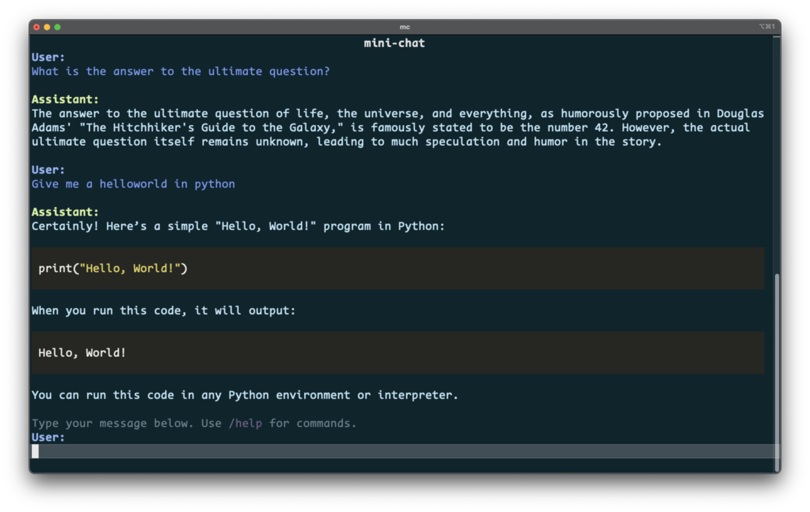

# mini-chat 🐜

A minimal terminal-based chatbot using Rich for UI and direct HTTP requests for API communication.



## Features

- 🎨 Rich terminal UI with syntax highlighting
- ✨ Markdown support and streaming responses
- ⚙️ Profile and configuration management
- 🪶 Extremely lightweight

## Installation

```bash
# Install from GitHub
pip install git+https://github.com/xingjian-zhang/mini-chat.git

# Development setup
git clone https://github.com/xingjian-zhang/mini-chat.git
cd mini-chat
uv venv && uv pip install -e ".[dev]"
```

Set your API key using OpenAI's standard environment variable:
```bash
export OPENAI_API_KEY=your_key_here
```

## Configure Profiles

The chatbot supports multiple configuration profiles, allowing you to save different settings for different use cases. Profiles are stored as YAML files in the `~/.mini_chat/profiles/` directory.

You can:
- Create multiple named profiles
- Switch between profiles during a session
- Clone existing profiles
- Delete profiles

All configuration changes are saved per-profile, making it easy to maintain different setups for different tasks.

## Usage

Run with `mini-chat` or `mc`

### Basic Commands

- Type normally to chat with the AI
- `/help` - Show help
- `/clear` - Clear conversation
- `/exit` - Exit
- `/system <msg>` - Add system instructions
- `/config` - View/change settings
- `/profile` - Manage configuration profiles

## Project Structure

```
mini_chat/
├── __init__.py      # Package initialization
├── __main__.py      # Application entry point
├── api.py           # API communication layer
├── cli.py           # Command-line interface handling
├── config.py        # Configuration management
├── models.py        # Data models
├── ui.py            # User interface components
└── utils.py         # Utility functions
```

## Development

```bash
# Lint and format
ruff check . --fix
ruff format .

# Run tests
pytest
```

See architecture.md for project structure details.

## Roadmap

- [ ] Support for additional LLM providers beyond OpenAI
- [ ] Conversation history management and persistence
- [ ] File attachment and context upload capabilities
- [ ] Custom themes and UI configurations
- [ ] MCP
